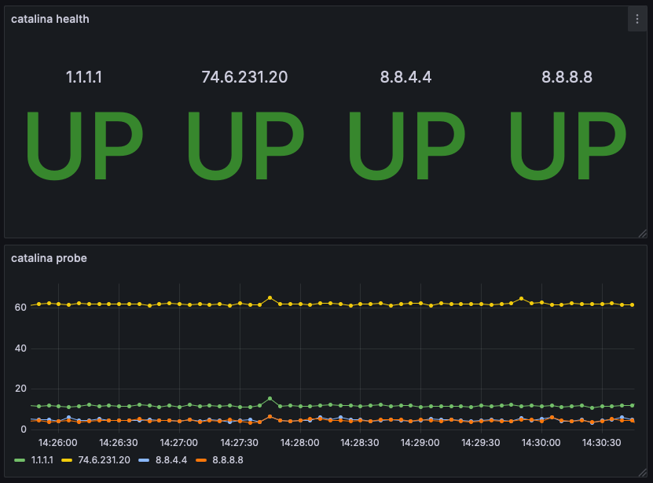

# Zontahnos

This is a framework aimed at monitoring network endpoints. It will turn up an API (FastAPI), TSDB (InfluxDB), and Grafana. With this, you can use zontahnos-agent (https://github.com/sjjensen2004/zontahnos-agent) which is an agent deployed on remote hosts that will monitor network endpoints. For example, if you have a critical application you will be able to monitor its network performance and avaialblity from multiple vantage points (i.e., DC, HQ, Branch offices) and discover/correct issues as they arise.

**_NOTE_** This is currently a solo project in beta. It has not been security hardened so use at your own risk.

Example visualization representing a zontahnos agent running locally probing 1.1.1.1, 8.8.8.8, and 8.8.4.4:

# Setup

## Create a .env file root directory
**Note:** Use env_example and just rename it to .env

The .env must contain the following vars:
<pre>
# INFLUX ENV_VARS
INFLUXDB_USERNAME=
INFLUXDB_PASSWORD=
INFLUXDB_TOKEN=
INFLUXDB_INIT_ORG=
INFLUXDB_INIT_BUCKET=

# GRAFANA ENV VARS
GF_SECURITY_ADMIN_USER=
GF_SECURITY_ADMIN_PASSWORD=

# VAULT ENV VARS
VAULT_DEV_ROOT_TOKEN_ID=
VAULT_ADDR=http://0.0.0.0:8200
VAULT_API_ADDR=http://0.0.0.0:8200
VAULT_LOG_LEVEL=info
VAULT_UI=true
</pre>

## Create a .env file in the zontahnos/app/app directory
Again, you can just rename the existing env_example to .env.

Populate this file with the fillowing:

<pre>
INFLUXDB_URL="http://influxdb2:8086"
INFLUXDB_TOKEN="The token you populated in the influxdb2-admin-token file"
ORG="netsmart"
BUCKET="network_monitoring"
GRAFANA_TOKEN="placeholder for later use"
</pre>

## Build
docker compose up --build

## Structure and Seed Vault - Stitch influx to grafana
Execute the script:
`python scripts/seed_zontahnos.py`

**Note** You may have to install zontahnos/app/requirements.txt if you are missing dependencies to run the script. 

## InfluxDB login
You log in using the username and passwords created in the root .env file referenced above.  

URL: http://127.0.0.1:8086

## Grafana login
By default, it pulls the user/pass from the docker compose file. 

URL: http://127.0.0.1:3000

## API Docs
The API docs are located at:

URL: http://127.0.0.1:8080/docs

## Basic workflow
Create a new icmp monitoring DB entry using the http://<api>:8080/api/v1/icmp/create endpoint. This will generate and return a secret which you should copy for use when activating zonthanos-agent(s).

## This is beta.
